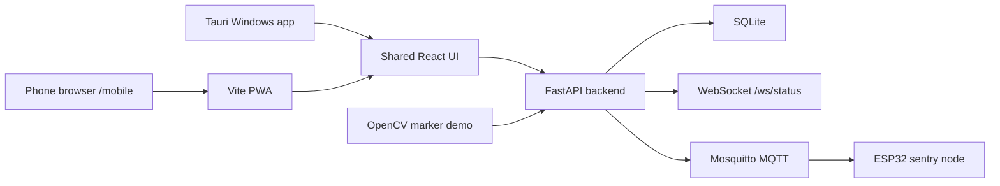

# Architecture

Sentinel Room is local-first:

```mermaid
flowchart LR
  Phone["Phone browser /mobile"] --> Web["Vite PWA"]
  Desktop["Tauri Windows app"] --> UI["Shared React UI"]
  Web --> UI
  UI --> API["FastAPI backend"]
  API --> DB["SQLite"]
  API --> WS["WebSocket /ws/status"]
  API --> MQTT["Mosquitto MQTT"]
  MQTT --> ESP32["ESP32 sentry node"]
  Vision["OpenCV marker demo"] --> API
```

Default binding is localhost. LAN mode must be explicitly enabled for phone control on trusted Wi-Fi.
