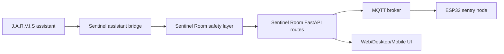

# Sentinel Room + J.A.R.V.I.S Future Implementation Guide

This file is for a future developer or AI agent that does not know this project. It explains how to integrate Sentinel Room with the user's existing local assistant later.

Do not implement the integration unless the user explicitly asks for it.

## Project locations

```text
Sentinel Room:
E:\SentinelRoom

Future assistant:
E:\J.A.R.V.I.S
```

Current Sentinel Room placeholders:

```text
ASSISTANT_INTEGRATION_ENABLED=false
ASSISTANT_LOCAL_PATH=E:\J.A.R.V.I.S
```

## What Sentinel Room is

Sentinel Room is a safe smart-room security prototype with:

- FastAPI backend at `backend\app`.
- React shared UI at `packages\ui`.
- Web/PWA app at `apps\web`.
- Tauri desktop app at `apps\desktop`.
- ESP32 firmware at `firmware\esp32_sentinel_node`.
- Wokwi simulation at `simulation\wokwi`.
- Vision demos at `vision`.

The project is safety-constrained. The pseudo-laser is only a normal low-power red LED behind a tube/pinhole/stencil.

## What J.A.R.V.I.S appears to be

Based on read-only inspection, `E:\J.A.R.V.I.S` appears to use:

- Node/Express backend in `E:\J.A.R.V.I.S\backend\server.js`.
- React frontend in `E:\J.A.R.V.I.S\frontend`.
- Local model files in `E:\J.A.R.V.I.S\backend\models`.
- Chat, vision, TTS, app-launch, status, and health style endpoints.
- A launch script at `E:\J.A.R.V.I.S\Launch-JARVIS.bat`.

Do not copy unsafe assets or behavior. In particular, do not import weapon-themed model assets into Sentinel Room.

## Integration principle

J.A.R.V.I.S may suggest or narrate. Sentinel Room backend decides and enforces safety.



Stop All must always bypass assistant logic:

```text
UI / physical button / backend route -> /api/stop-all -> MQTT stop_all -> device failsafe
```

## Suggested integration steps

1. Add a disabled backend router:

```text
backend\app\routes\assistant.py
```

2. Add a config flag:

```text
ASSISTANT_INTEGRATION_ENABLED=false
ASSISTANT_LOCAL_PATH=E:\J.A.R.V.I.S
ASSISTANT_BASE_URL=http://127.0.0.1:3002
```

3. Add a read-only assistant status endpoint:

```text
GET /api/assistant/status
```

This endpoint should only report whether the configured assistant path/base URL exists and is reachable.

4. Add an intent endpoint:

```text
POST /api/assistant/intent
```

Suggested request:

```json
{
  "intent": "summarize_status",
  "params": {},
  "requires_confirmation": false
}
```

Suggested response:

```json
{
  "ok": true,
  "allowed": true,
  "action": "read_status",
  "message": "System is armed. Sentry Alpha is idle."
}
```

5. Keep a strict allow-list.

Allowed assistant intents:

- `read_status`
- `summarize_events`
- `explain_safety_state`
- `show_network_info`
- `show_calibration_points`
- `suggest_calibration_check`
- `prepare_demo`
- `start_demo_after_user_confirmation`
- `stop_all`

Blocked assistant intents:

- Any real laser command.
- Any weapon-like command.
- Any exact body/face/torso aiming.
- Any automatic mist/spray command.
- Any command that bypasses PIN/session auth.
- Any public internet exposure or port-forwarding.

6. Require confirmation for physical actions.

Assistant may say:

```text
I can start the cinematic demo. Confirm in the Sentinel Room UI.
```

The UI/backend must still require a user action before:

- Demo start.
- Lockdown.
- Mist manual test.
- Any hardware movement outside idle scan.

7. Never let J.A.R.V.I.S call MQTT directly.

All hardware commands must go through Sentinel Room:

```text
J.A.R.V.I.S -> Sentinel backend assistant route -> safety.py -> existing API/service -> mqtt_client.py
```

## Mannequin detection integration

Sentinel Room includes:

```text
vision\mannequin_detect.py
POST /api/vision/mannequin
```

This is logging/display only.

Allowed mannequin data:

```json
{
  "detected": true,
  "region": "center",
  "confidence": 0.74,
  "safe_zone_only": true
}
```

Do not pass bounding boxes, exact aim coordinates, or servo target angles from mannequin/person detection.

J.A.R.V.I.S may summarize:

```text
Mannequin-form detected in the center region.
```

J.A.R.V.I.S must not say or do:

```text
Aim at the mannequin.
Turn on laser.
Track the torso.
Spray the subject.
```

## Multi-sentry future design

Current Sentinel Room has one active sentry:

```text
sentry-main / Sentry Alpha
```

Future multi-sentry shape:

```json
{
  "id": "sentry-desk",
  "label": "Sentry Desk",
  "role": "pan-tilt sentry head",
  "online": true,
  "mqtt_prefix": "sentinel/units/sentry-desk",
  "calibration_profile": "desk"
}
```

Recommended MQTT expansion:

```text
sentinel/units/{unit_id}/device/status
sentinel/units/{unit_id}/sensor/pir
sentinel/units/{unit_id}/sentry/state
sentinel/units/{unit_id}/cmd/sentry/mode
sentinel/units/{unit_id}/cmd/sentry/move
sentinel/units/{unit_id}/cmd/stop_all
```

Recommended database changes:

- Add `unit_id` to `calibration_points`.
- Add `unit_id` to `events`.
- Add `unit_id` to `devices`.
- Keep global Stop All broadcasting to every unit.

## UI integration

Existing placeholder:

```text
packages\ui\src\components\AssistantDock.tsx
```

Future assistant UI should:

- Show assistant connection state.
- Show suggestions as read-only cards.
- Require user confirmation for physical actions.
- Keep Stop All always visible.
- Never hide safety state behind assistant UI.

## Backend files to modify later

```text
backend\app\config.py
backend\app\safety.py
backend\app\routes\assistant.py
backend\app\services\assistant_service.py
backend\tests\test_assistant.py
```

## Frontend files to modify later

```text
packages\ui\src\components\AssistantDock.tsx
packages\ui\src\api\client.ts
packages\ui\src\api\types.ts
packages\ui\src\pages\Settings.tsx
```

## Test requirements for future integration

Must pass:

- Assistant disabled by default.
- Assistant status route is read-only.
- Unsafe assistant intents are rejected.
- Physical actions require confirmation.
- Stop All works even if assistant server is offline.
- Stop All does not depend on J.A.R.V.I.S.
- Mannequin detection never produces servo aim coordinates.
- Multi-sentry Stop All sends safe command to every unit.

## Final warning

Sentinel Room is not a weapon system. Keep it safe, local-first, and bounded by the backend safety layer.
